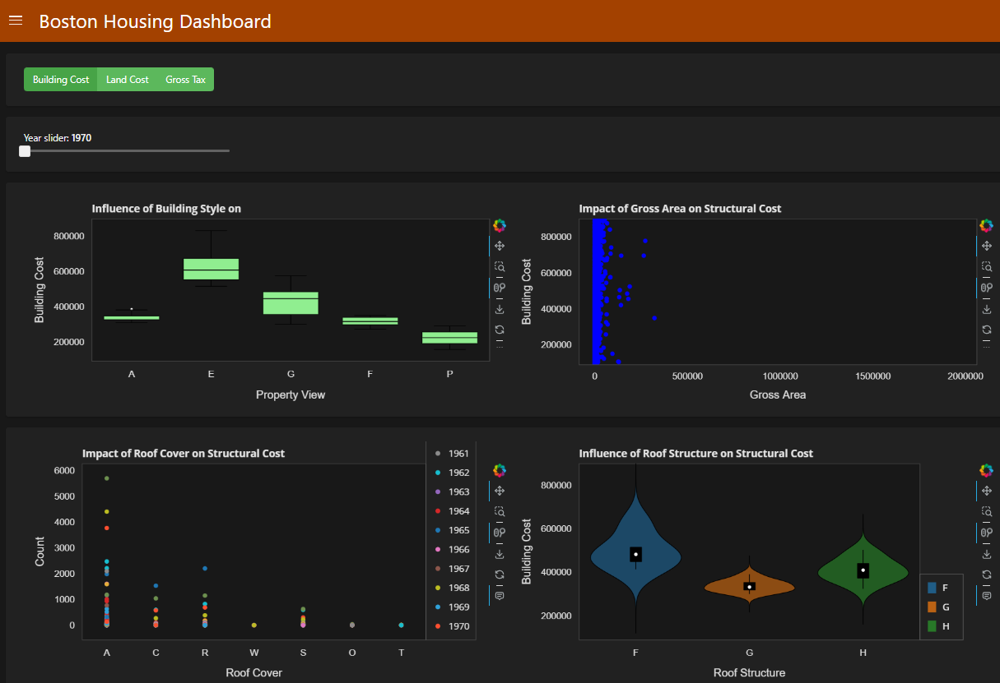

# Boston Housing

## Description

Behold, the urban tapestry of Boston, a veritable crucible of intellectual prowess and economic dynamism, where the pursuit of domicile becomes a formidable quest. This venerable metropolis, steeped in history and academia, presents a real estate landscape as complex and nuanced as the most intricate chess game.

To illuminate this intricate graphics, we turn our gaze upon the Boston Assessment 2022 dataset—a veritable treasure trove of information. This compendium of urban intelligence comprises a staggering one hundred sixty-eight thousand and one hundred and sixteen individual records, each a thread in the rich tapestry of Boston's real estate fabric. With fifty-six columns of data, it offers a multifaceted lens through which to examine the myriad factors that shape this dynamic market.

In essence, Boston's housing market is not merely a collection of properties, but a living, breathing ecosystem—one that reflects the city's storied past, vibrant present, and promising future. It is a market that demands respect, rewards perseverance, and continues to captivate those who dare to make their home in this bastion of American urbanity.

## EDA

## Predictive Analytics
    - Linear Regression
    - Random Forest
    - LightGBM Regression
    - Ridge Regression
    - Lasso Regression

The analysis focused on key real estate features, carefully selected using `Variance Inflation Factor` (VIF) to minimize multicollinearity while capturing diverse property aspects. These included kitchen details, location, building type, exterior condition, bathroom style, HVAC systems, and property tax. This comprehensive yet non-redundant set of features was then used in predictive modeling. The `LightGBM` model emerged as the top performer, achieving an impressive `80.87%` accuracy in predicting the target variable, demonstrating its effectiveness for this particular dataset.
